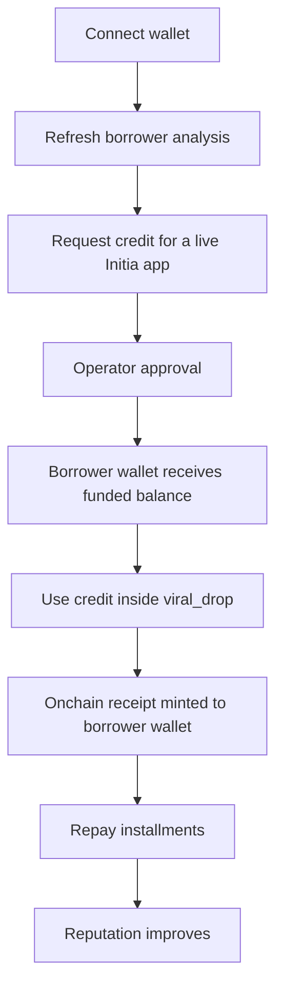

# LendPay

LendPay is an Initia MiniMove appchain for agent-guided credit across Initia apps.

It combines:

- a React frontend for app credit requests, live viral drop usage, repayment, rewards, and ecosystem activity
- a Go backend for sessions, underwriting, protocol sync, and operator actions
- Move smart contracts for requests, approvals, repayments, collateral, rewards, staking, governance, campaigns, and app rails

## Architecture At A Glance

1. The frontend connects the wallet and submits Move transactions.
2. The backend authenticates the borrower, computes score output, mirrors product state, and performs operator actions.
3. The MiniMove rollup executes the protocol logic onchain.

Docs by layer:

- frontend technical docs: [frontend/README.md](./frontend/README.md)
- backend technical docs: [backend-go/README.md](./backend-go/README.md)
- smart contract technical docs: [smarcontract/README.md](./smarcontract/README.md)
- standalone docs site: [docs-site](./docs-site)

## Problem

Onchain finance is already good at moving assets, but it is still bad at financing real app usage.

Users can bridge, trade, and swap, yet they still cannot easily pay over time for the experiences they actually want inside apps: drops, passes, collectibles, memberships, and other consumer actions.

The result is a real ecosystem gap:

- borrowers may have visible onchain reputation, but no usable installment credit
- partner apps have demand at checkout, but no reusable credit rail built for Initia-native flows
- repayment behavior can happen onchain, but it still rarely compounds into stronger future access

## Solution

LendPay turns wallet activity, `.init` identity, and repayment history into an app-native credit rail for Initia.

It combines:

- a borrower-facing frontend for request, usage, repayment, rewards, and ecosystem actions
- a Go backend for wallet-authenticated sessions, underwriting, state sync, and operator actions
- Move contracts on a MiniMove rollup for requests, approvals, repayments, collateral, rewards, staking, governance, campaigns, and app-linked rails

Instead of treating credit as a detached lending screen, LendPay keeps the flow tied to a real product action: connect wallet, refresh profile state, request app credit, receive operator approval, use the funded balance in `viral_drop`, mint an onchain receipt, and repay over time.

Small app requests are reputation-based and unsecured. A separate advanced profile supports locked `LEND` collateral for larger secured requests. The goal is not abstract leverage. The goal is usable pay-later access inside real Initia app flows.

## Real-World Impact

If LendPay works as intended, it pushes wallet reputation out of dashboards and into real economic utility:

- borrowers get a real pay-later path for Initia app experiences instead of being limited to spot spending
- partner apps get a reusable credit checkout layer without rebuilding financing logic from scratch
- good repayment behavior becomes a compounding onchain reputation signal instead of a passive record
- the Initia ecosystem gets stronger commerce infrastructure built around app usage, not only swaps, bridges, and speculative activity

## Core Flow

LendPay is currently tightened around one truthful internal borrower flow:

1. connect wallet and refresh borrower analysis
2. request credit for a live Initia app
3. operator approval funds the borrower wallet
4. the borrower uses that funded balance in `viral_drop`
5. an onchain receipt is minted to the borrower wallet
6. the borrower repays installments and improves reputation



## Initia Native Features Used

- InterwovenKit wallet/session UX
- Initia Usernames (`.init`)
- Interwoven Bridge surface for `LEND` exit routing
- MiniMove rollup execution for credit, receipts, and repayment

## Quick Start

Start the full local stack from the repo root:

```bash
make up
```

Important:

- `make up` starts the rollup node, backend, frontend, docs, and local Postgres only.
- It does not bootstrap the Rapid relayer or OPinit bots required to keep the rollup built-in oracle populated.
- Having `LEND` on the rollup is not sufficient by itself; the oracle bridge also depends on funded system keys and services on the L1 side.
- Backend oracle views can still look healthy because the backend reads Connect REST directly, while Move calls through `0x1::oracle` depend on the rollup oracle state itself.
- The current local `lendpay-4` state already includes the onchain `bridge` helper module and one registered `LEND -> MiniEVM` route.
- That route currently publishes `InitiaDEX` and `LEND/INIT` as the destination venue metadata, but it still stays in preview until the official MiniEVM denom-to-ERC20 mapping for `ulend` is live.

Check status:

```bash
make status
```

Stop everything:

```bash
make down
```

Restart everything:

```bash
make restart
```

Show log locations:

```bash
make logs
```

## Local URLs

- frontend: `http://localhost:5173`
- explorer: `http://localhost:5173/scan.html`
- docs: `http://localhost:4173`
- backend: `http://localhost:8080`
- rollup RPC: `http://localhost:26657`
- rollup REST: `http://localhost:1317`

## Public Pre-Production URLs

- app: `https://lendpay.vercel.app/`
- explorer: `https://lendpay.vercel.app/scan.html`
- docs: `https://lendpay-docs.vercel.app/`

These URLs are public demo or pre-production surfaces.
Some backend-admin flows and the final `LEND -> MiniEVM` sell path still remain in preview until the missing live mapping and write paths are fully ready.

## Local Demo Flow

1. Run `make up`
2. Open docs at `http://localhost:4173` if you want the product and architecture reference site
3. Open `http://localhost:5173`
4. Connect wallet with InterwovenKit
5. Analyze borrower profile
6. Choose the live app and request credit
7. Approve the request through the operator flow
8. Use the funded balance in the live viral drop
9. Open `Ecosystem` to inspect the onchain `LEND -> MiniEVM` bridge route and liquidity metadata
10. Repay through the live rollup flow

## Recorded Rollup Evidence

- local rollup chain id: `lendpay-4`
- package address: `0x5972A1C7118A8977852DC3307621535D5C1CDA63`
- package upgrade with `bridge.move`: `A36F31E75969F9D285EEA503F6046D065AA3A0B56561B5E04F2EB9DAB8D251FA`
- `bridge::initialize`: `8C7F9944ABB35AA2F5BFF2C7F596D1A6F21D7CE7B7C8D5F3BDD7F4C82561AE30`
- `bridge::register_route`: `A2D0DF04150D326D951A0EE13AA4600EBD22D6F03C62F6440DB5913B05A54C53`
- viral drop init tx: `FBACB5F822F6D75BA9F2AF8CD2A3C9DD50F8D74629306F96B7B244DB633DDC6D`
- partner app register tx: `2BD5EC0362C534A0A7E5AF030897029C291C7FEF426156A7FEA5F09EED2280F2`
- request tx: `48A044189CC75E1877E455D208E2F22BD6706DDF25DF410D62144D4DB9E3D5A2`
- approval tx: `E4E34699EE84E54C9A9552013970F392EE2E03EA8D6C4B1C4E651C5D6EA5E722`
- packaged artifacts: [smarcontract/artifacts/testnet/lendpay-4](./smarcontract/artifacts/testnet/lendpay-4)
- submission metadata: [.initia/submission.json](./.initia/submission.json)

Current local bridge route published onchain:

- source chain: `lendpay-4`
- source denom: `ulend`
- destination chain: `evm-1`
- destination denom: `erc20/LEND`
- liquidity venue: `InitiaDEX`
- pool reference: `LEND/INIT`
- route status: preview until the official MiniEVM mapping is published

## App Hosting

Recommended app hosting split:

- frontend on Vercel from [`frontend`](./frontend)
- backend on Railway from [`backend-go`](./backend-go)

The frontend already includes [frontend/vercel.json](./frontend/vercel.json).

The backend now ships from:

- [backend-go/Dockerfile](./backend-go/Dockerfile)
- [backend-go/railway.json](./backend-go/railway.json)

Railway monorepo note:

- preferred Railway UI values for the backend service:
  Root Directory: leave empty
  Builder: `Dockerfile`
  Dockerfile Path: `deploy/railway/backend/Dockerfile`
  Watch Paths: `/backend-go/**`
  Healthcheck Path: `/api/v1/health`
  Config-as-code: `/deploy/railway/backend/railway.json`
- alternative if the service Root Directory is `backend-go`:
  Dockerfile Path: `Dockerfile`
  Config-as-code: `/backend-go/railway.json`
- do not use `backend/Dockerfile`
- if Railway logs show Prisma or `prisma.user.findUnique()`, you are still deploying the retired backend instead of the Go backend

The rollup can also be packaged for Railway with Docker:

- [deploy/railway/deploy/Dockerfile](./deploy/railway/deploy/Dockerfile)
- [deploy/railway/deploy/README.md](./deploy/railway/deploy/README.md)
- `make railway-deploy-prepare`

Important note:

- the app layer can be public on Vercel/Railway
- the rollup still needs a public RPC/REST host if you want the chain itself to stop depending on `localhost`
