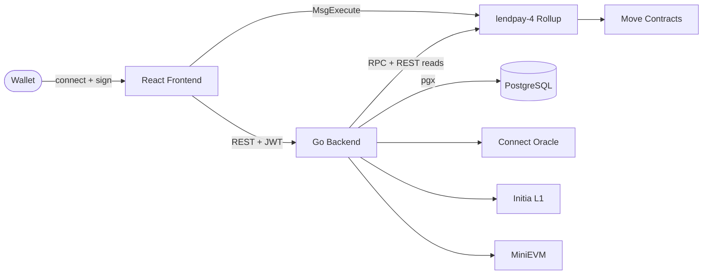
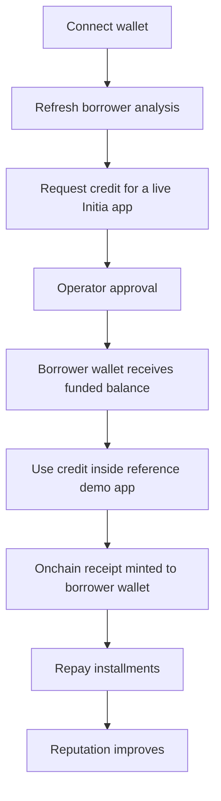

# LendPay

LendPay is a Move-native pay-later rail for Initia app usage.

It turns wallet reputation, `.init` identity, and repayment history into reusable credit across Initia apps — built as:

- a React frontend for credit requests, viral drop usage, repayment, rewards, and ecosystem activity
- a Go backend for wallet auth, underwriting, protocol sync, and operator actions
- Move smart contracts for requests, approvals, repayments, collateral, rewards, staking, governance, campaigns, and app rails

## Judge Quick Scan

- product: app-native credit for real Initia checkout and usage flows, not a generic lending dashboard
- track fit: `DeFi`, with a live on-chain credit flow and a reference demo app integration for spend usage
- Initia proof: dedicated MiniMove rollup `lendpay-4`, InterwovenKit wallet flow, `.init` usernames, auto-sign session UX, and bridge-route registry support
- core demo: connect -> analyze -> request -> approve -> use -> repay
- public surfaces: [app](https://lendpay.vercel.app/), [docs](https://lendpay-docs.vercel.app/), [explorer](https://lendpay.vercel.app/scan.html)
- judge docs: [hackathon readiness](./docs-site/docs/guide/hackathon-readiness.md), [scoring criteria](./docs-site/docs/guide/scoring-criteria.md), [testnet evidence](./docs-site/docs/reference/testnet.md)

## Architecture At A Glance

1. The frontend connects the wallet and submits Move transactions.
2. The backend authenticates the borrower, computes score output, mirrors product state, and performs operator actions.
3. The MiniMove rollup executes the protocol logic onchain.



Docs by layer:

- frontend technical docs: [frontend/README.md](./frontend/README.md)
- backend technical docs: [backend-go/README.md](./backend-go/README.md)
- smart contract technical docs: [smarcontract/README.md](./smarcontract/README.md)
- standalone docs site: [docs-site](./docs-site)

## Project Structure

```
lendpay/
├── frontend/                          # React + Vite borrower app (Vercel)
│   ├── src/
│   │   ├── main.tsx                   # app entry, providers, QueryClient, Wagmi
│   │   ├── App.tsx                    # orchestration, state, tx dispatch
│   │   ├── components/
│   │   │   ├── pages/                 # Overview, Profile, Request, Repay, Loyalty, Ecosystem
│   │   │   ├── shared/                # TxPreviewModal, ProofModal, ErrorBoundary
│   │   │   ├── layout/                # shell and nav layout
│   │   │   ├── loans/                 # loan-specific UI
│   │   │   ├── score/                 # score display UI
│   │   │   └── ui/                    # base UI primitives
│   │   ├── hooks/
│   │   │   ├── useBackendSession.ts   # JWT session creation and reuse
│   │   │   ├── useAutoSignPermission.ts
│   │   │   └── useTxPreview.ts        # pre-wallet modal state
│   │   ├── lib/
│   │   │   ├── api.ts                 # backend API client
│   │   │   ├── move.ts                # MsgExecute builders
│   │   │   ├── auth.ts                # wallet signing helpers for login
│   │   │   ├── tx.ts                  # tx hash extraction
│   │   │   ├── appHelpers.ts          # labels, grouping, formatting
│   │   │   └── nav.ts                 # shared navigation model
│   │   ├── config/
│   │   │   ├── chain.ts               # custom chain for InterwovenKit
│   │   │   └── env.ts                 # Vite env mapping
│   │   ├── types/domain.ts
│   │   └── styles/                    # CSS layers: foundation, tokens, pages, shell
│   ├── public/
│   │   ├── brand/                     # LendPay logo assets
│   │   ├── drops/                     # viral drop item SVGs
│   │   ├── cabal/                     # mock Cabal item SVGs
│   │   ├── yominet/                   # mock Yominet item SVGs
│   │   ├── intergaze/                 # mock Intergaze item SVGs
│   │   └── scan.html                  # standalone chain explorer
│   ├── index.html
│   ├── vite.config.ts
│   ├── tsconfig.json
│   ├── vercel.json
│   ├── .env.example
│   └── .env.production.example
├── backend-go/                        # Go API server (Railway)
│   ├── cmd/
│   │   └── server/
│   │       └── main.go                # entry point, HTTP server startup
│   ├── internal/
│   │   └── app/
│   │       ├── server.go              # router, handlers, borrower workflows
│   │       ├── config.go              # env loading and normalization
│   │       ├── db.go                  # pgx pool, schema bootstrap, SQL helpers
│   │       ├── bootstrap.sql          # embedded schema for first-run
│   │       ├── auth.go                # challenge, session token, personal_sign verify
│   │       ├── amino.go               # Amino signature fallback
│   │       ├── models.go              # response shapes and row models
│   │       ├── errors.go              # API error helpers
│   │       ├── formatting.go          # response formatters
│   │       ├── rate_limit.go          # in-memory throttling
│   │       ├── oracle_client.go       # Connect oracle feed
│   │       ├── rollup_client.go       # rollup RPC/REST reads
│   │       ├── move_view_codec.go     # Move view decode helpers
│   │       ├── minievm_client.go      # MiniEVM metadata lookups
│   │       ├── usernames_client.go    # Initia username integration
│   │       ├── ollama_client.go       # AI provider status
│   │       └── agent.go               # agent autonomy helpers
│   ├── go.mod
│   ├── go.sum
│   ├── Dockerfile
│   ├── railway.json
│   └── .env.example
├── smarcontract/                      # Move smart contracts
│   ├── sources/
│   │   ├── bootstrap/
│   │   │   └── bootstrap.move             # protocol initialization
│   │   ├── credit/
│   │   │   ├── config.move                # admin policy and pause state
│   │   │   ├── loan_book.move             # request → approve → repay → default
│   │   │   ├── treasury.move              # native asset custody and disbursement
│   │   │   ├── profiles.move              # product profiles and collateral quoting
│   │   │   ├── merchant_registry.move     # app rail registry
│   │   │   ├── bridge.move                # cross-VM route registry and bridge intents
│   │   │   ├── reputation.move            # borrower identity and repayment reputation
│   │   │   ├── viral_drop.move            # reference app: funded purchase + receipt mint
│   │   │   ├── mock_cabal.move            # mock app route #2
│   │   │   ├── mock_yominet.move          # mock app route #3
│   │   │   └── mock_intergaze.move        # mock app route #4
│   │   ├── rewards/
│   │   │   ├── rewards.move               # points, LEND claims, perks
│   │   │   ├── campaigns.move             # campaign allocations and claims
│   │   │   └── referral.move              # referral tracking
│   │   ├── tokenomics/
│   │   │   ├── lend_token.move            # native LEND ledger and supply control
│   │   │   ├── fee_engine.move            # origination and late fee settlement
│   │   │   ├── staking.move               # staking lifecycle and rewards
│   │   │   ├── governance.move            # proposal, voting, finalize
│   │   │   └── tokenomics.move            # quote helpers: tiers, discounts, splits
│   │   └── shared/
│   │       ├── errors.move                # common error codes
│   │       └── assets.move                # fungible asset helpers
│   ├── tests/
│   │   ├── credit/
│   │   │   ├── flow_tests.move            # request, approve, repay, viral drop flows
│   │   │   └── bridge_tests.move          # bridge route and intent flows
│   │   ├── rewards/
│   │   │   └── rewards_tests.move         # points, claims, campaign tests
│   │   ├── tokenomics/
│   │   │   └── tokenomics_tests.move      # fees, staking, governance tests
│   │   └── shared/
│   │       └── test_support.move          # shared test helpers
│   ├── scripts/rollup/
│   │   ├── deploy.sh                      # publish Move package
│   │   ├── bootstrap.sh                   # initialize protocol onchain
│   │   ├── fund-liquidity.sh              # fund loan vault
│   │   ├── mint-lend-reserve.sh           # mint LEND into protocol reserve
│   │   ├── viral-drop-flow.sh             # full borrower demo flow
│   │   ├── build.sh
│   │   ├── test.sh
│   │   ├── common.sh
│   │   └── .env.example
│   ├── artifacts/
│   │   ├── testnet/
│   │   │   ├── lendpay-4/                 # active testnet deploy evidence
│   │   │   │   ├── deploy.json
│   │   │   │   ├── bootstrap.json
│   │   │   │   ├── fund-liquidity.json
│   │   │   │   ├── mint-lend-reserve.json
│   │   │   │   ├── register-*.json        # merchant registration txs
│   │   │   │   ├── app-route-proof/       # per-merchant buy + receipt proofs
│   │   │   │   ├── core-flow-verification/# full borrower flow step txs
│   │   │   │   └── viral-drop-flow-delivery/
│   │   │   └── lendpay-3/                 # previous testnet archive
│   │   └── rollup/                        # local rollup deploy and demo artifacts
│   │       ├── deploy.json
│   │       ├── bootstrap.json
│   │       └── demo/                      # step-by-step demo flow txs
│   └── Move.toml
├── sources/                           # top-level Move sources (package root)
├── docs-site/                         # Docusaurus reference site (Vercel)
├── deploy/
│   └── railway/
│       ├── backend/                   # preferred Railway backend Dockerfile + config
│       ├── rollup/                    # rollup Railway config
│       └── deploy/                    # rollup deploy tooling
├── scripts/
│   ├── local-stack-up.sh
│   ├── local-stack-down.sh
│   ├── local-stack-status.sh
│   ├── go-bin.sh
│   └── railway-deploy-prepare.sh
├── .github/
│   └── workflows/
│       └── backend-railway-cli-deploy.yml
├── .initia/
│   └── submission.json                # hackathon submission metadata
├── Dockerfile                         # repo-root Railway fallback build
├── railway.json                       # repo-root Railway fallback config
├── Makefile                           # make up / down / status / restart / logs
├── Move.toml                          # Move package manifest
├── docker-compose.local-stack.yml
└── lendpay-scan-chain.json
```

## Problem

Onchain finance moves assets well. It does not finance app usage.

Users can bridge, trade, and swap. They still cannot pay over time for the experiences they want inside apps — drops, passes, collectibles, memberships, consumer actions.

The gap is structural:

- borrowers carry visible onchain reputation, but have no usable installment credit
- partner apps have demand at checkout, but no reusable credit rail built for Initia-native flows
- repayment behavior happens onchain, but rarely compounds into stronger future access

## Solution

LendPay turns wallet activity, `.init` identity, and repayment history into an app-native credit rail for Initia.

Instead of a detached lending screen, LendPay ties credit to a concrete product action: connect wallet, refresh profile, request app credit, receive operator approval, use the funded balance in a reference app, mint an onchain receipt, and repay over time.

Small requests are reputation-based and unsecured. A separate advanced profile accepts locked `LEND` collateral for larger secured requests. The goal is pay-later access inside real Initia app flows, not abstract leverage.

The credit rail is live today: request, approval, funding, usage, receipt, and repayment all run through the current stack. `viral_drop` is the reference demo app integration — it shows how LendPay plugs into real Initia apps such as drops, memberships, game items, and DeFi access.

## Real-World Impact

If LendPay works as intended, it pushes wallet reputation out of dashboards and into real economic utility:

- borrowers get a real pay-later path for Initia app experiences instead of being limited to spot spending
- partner apps get a reusable credit checkout layer without rebuilding financing logic from scratch
- good repayment behavior becomes a compounding onchain reputation signal instead of a passive record
- the Initia ecosystem gets stronger commerce infrastructure built around app usage, not only swaps, bridges, and speculative activity

## Core Flow

LendPay demonstrates one complete internal borrower flow:

1. connect wallet and refresh borrower analysis
2. request credit for a live Initia app
3. operator approval funds the borrower wallet
4. the borrower uses that funded balance in the reference `viral_drop` demo app
5. an onchain receipt is minted to the borrower wallet
6. the borrower repays installments and improves reputation



## Initia Native Features Used

- InterwovenKit wallet/session UX
- Initia Usernames (`.init`)
- Interwoven Bridge surface for `LEND` exit routing
- MiniMove rollup execution for credit, receipts, and repayment

## Quick Start

Start the full local stack from the repo root:

```bash
make up
```

Important:

- `make up` starts the rollup node, backend, frontend, docs, and local Postgres only.
- It does not bootstrap the Rapid relayer or OPinit bots required to keep the rollup built-in oracle populated.
- Having `LEND` on the rollup is not sufficient by itself; the oracle bridge also depends on funded system keys and services on the L1 side.
- Backend oracle views can still look healthy because the backend reads Connect REST directly, while Move calls through `0x1::oracle` depend on the rollup oracle state itself.
- The current local `lendpay-4` state already includes the onchain `bridge` helper module and one registered `LEND -> MiniEVM` route.
- That route currently publishes `InitiaDEX` and `LEND/INIT` as the destination venue metadata, but it still stays in preview until the official MiniEVM denom-to-ERC20 mapping for `ulend` is live.

Check status:

```bash
make status
```

Stop everything:

```bash
make down
```

Restart everything:

```bash
make restart
```

Show log locations:

```bash
make logs
```

## Local URLs

- frontend: `http://localhost:5173`
- explorer: `http://localhost:5173/scan.html`
- docs: `http://localhost:4173`
- backend: `http://localhost:8080`
- rollup RPC: `http://localhost:26657`
- rollup REST: `http://localhost:1317`

## Public Pre-Production URLs

- app: `https://lendpay.vercel.app/`
- explorer: `https://lendpay.vercel.app/scan.html`
- docs: `https://lendpay-docs.vercel.app/`

These URLs are public demo or pre-production surfaces.
Some backend-admin flows and the final `LEND -> MiniEVM` sell path still remain in preview until the missing live mapping and write paths are fully ready.

## Local Demo Flow

1. Run `make up`
2. Open docs at `http://localhost:4173` if you want the product and architecture reference site
3. Open `http://localhost:5173`
4. Connect wallet with InterwovenKit
5. Analyze borrower profile
6. Choose the live app and request credit
7. Approve the request through the operator flow
8. Use the funded balance in the live viral drop
9. Open `Ecosystem` to inspect the onchain `LEND -> MiniEVM` bridge route and liquidity metadata
10. Repay through the live rollup flow

## Recorded Rollup Evidence

- local rollup chain id: `lendpay-4`
- package address: `0x5972A1C7118A8977852DC3307621535D5C1CDA63`
- package upgrade with `bridge.move`: `A36F31E75969F9D285EEA503F6046D065AA3A0B56561B5E04F2EB9DAB8D251FA`
- `bridge::initialize`: `8C7F9944ABB35AA2F5BFF2C7F596D1A6F21D7CE7B7C8D5F3BDD7F4C82561AE30`
- `bridge::register_route`: `A2D0DF04150D326D951A0EE13AA4600EBD22D6F03C62F6440DB5913B05A54C53`
- viral drop init tx: `FBACB5F822F6D75BA9F2AF8CD2A3C9DD50F8D74629306F96B7B244DB633DDC6D`
- partner app register tx: `2BD5EC0362C534A0A7E5AF030897029C291C7FEF426156A7FEA5F09EED2280F2`
- request tx: `48A044189CC75E1877E455D208E2F22BD6706DDF25DF410D62144D4DB9E3D5A2`
- approval tx: `E4E34699EE84E54C9A9552013970F392EE2E03EA8D6C4B1C4E651C5D6EA5E722`
- packaged artifacts: [smarcontract/artifacts/testnet/lendpay-4](./smarcontract/artifacts/testnet/lendpay-4)
- submission metadata: [.initia/submission.json](./.initia/submission.json)

Current local bridge route published onchain:

- source chain: `lendpay-4`
- source denom: `ulend`
- destination chain: `evm-1`
- destination denom: `erc20/LEND`
- liquidity venue: `InitiaDEX`
- pool reference: `LEND/INIT`
- route status: preview until the official MiniEVM mapping is published

## App Hosting

Recommended app hosting split:

- frontend on Vercel from [`frontend`](./frontend)
- backend on Railway from [`backend-go`](./backend-go)

The frontend already includes [frontend/vercel.json](./frontend/vercel.json).

The backend now ships from:

- [Dockerfile](./Dockerfile)
- [railway.json](./railway.json)
- [backend-go/Dockerfile](./backend-go/Dockerfile)
- [backend-go/railway.json](./backend-go/railway.json)

Railway monorepo note:

- zero-config fallback from the repo root now works:
  Root Directory: leave empty
  Builder: `Dockerfile`
  Dockerfile Path: `Dockerfile`
  Config-as-code: `/railway.json`
- preferred Railway UI values for the backend service:
  Root Directory: leave empty
  Builder: `Dockerfile`
  Dockerfile Path: `deploy/railway/backend/Dockerfile`
  Watch Paths: `/backend-go/**`
  Healthcheck Path: `/api/v1/health`
  Config-as-code: `/deploy/railway/backend/railway.json`
- alternative if the service Root Directory is `backend-go`:
  Dockerfile Path: `Dockerfile`
  Config-as-code: `/backend-go/railway.json`
- if you deploy `balanced-peace` via `.github/workflows/backend-railway-cli-deploy.yml`,
  disable Railway's GitHub autodeploy for that same service to avoid duplicate snapshot
  attempts against the monorepo
- do not use `backend/Dockerfile`
- if Railway logs show Prisma or `prisma.user.findUnique()`, you are still deploying the retired backend instead of the Go backend

The rollup can also be packaged for Railway with Docker:

- [deploy/railway/deploy/Dockerfile](./deploy/railway/deploy/Dockerfile)
- [deploy/railway/deploy/README.md](./deploy/railway/deploy/README.md)
- `make railway-deploy-prepare`

Important note:

- the app layer can be public on Vercel/Railway
- the rollup still needs a public RPC/REST host if you want the chain itself to stop depending on `localhost`
