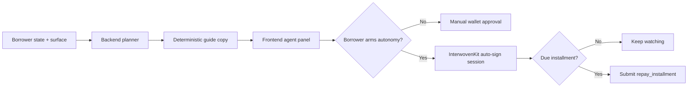

# Agentic Guide System

The backend agent guide turns borrower state into a concrete next best step. It drives panel copy, recommendations, and action labels while keeping all values grounded in backend and onchain truth.

## Two Layers

| Layer | Role |
| --- | --- |
| Planner | Deterministic — always runs, always produces a safe next step |
| Autonomy | Optional — executes a due repayment when the borrower explicitly arms it |

The planner never invents facts. The autonomy layer is bounded by wallet-managed permission and cannot act without explicit borrower opt-in.

## Planner Layer

Returned from `GET /api/v1/agent/guide` (and `POST` when the frontend has richer context).

Each response includes:

- `panelTitle`, `panelBody` — display copy for the current surface
- `recommendation` — the safest next move
- `actionKey`, `actionLabel` — wired to a concrete frontend action
- `confidence` — scoring confidence
- `checklist` — borrower-state summary

Surfaces: `overview`, `analyze`, `request`, `loan`, `rewards`, `admin`.

Common action keys: `analyze_profile`, `open_request`, `repay_now`, `open_repay`, `claim_rewards`.

## Borrower-Approved Auto-Repay

Auto-repay is allowed only when all of these are true:

- Borrower connected an Initia wallet
- Borrower explicitly enabled InterwovenKit auto-sign
- Borrower explicitly armed LendPay auto-repay
- Active loan has a due installment
- Supported Move repayment action is available
- LendPay browser session is still active

If any condition drops, the system falls back to manual wallet approval.

The autonomy layer is limited to supported Move repayment calls, uses a temporary InterwovenKit auto-sign session, and only runs while the browser is active on LendPay. No custodial hot wallet, no hidden server-side signer.

## Flow

## Planner Inputs

- Latest score, risk band, APR, and limit
- Loan requests and their status
- Active loans and repayment schedule
- Claimable rewards and borrower tier

## Optional Ollama Rewrite

Set `AI_PROVIDER=ollama` with `OLLAMA_BASE_URL` and `OLLAMA_MODEL` to enable natural-language rewriting of guide copy. The rewrite layer is sanitized — if the model introduces new amounts, dates, or facts, the response is discarded and deterministic copy is used instead.

## Guardrails

- Planner output cannot invent new action keys
- Autonomy is limited to a narrow supported repayment path
- The wallet session is temporary and revocable
- Backend and chain remain the final source of truth

## Related Docs

- [Agentic Paylater On Initia](/guide/agentic-paylater)
- [Architecture](/guide/architecture)
- [Frontend](/app/frontend)
- [Backend](/app/backend)
