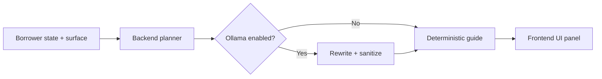

# Agentic Guide System

LendPay uses a server-side "agent guide" to turn borrower state into a concrete next best step. The guide drives the UI copy (title, body, recommendation) while keeping actions deterministic in the backend.

This is not a fully autonomous agent. It is a planning layer that translates state into guidance, with optional model-assisted rewriting for tone.

## What The Agent Guide Does

The guide is generated by the backend planner and returned from:

`GET /api/v1/agent/guide`

It produces:

- a panel title and body
- a recommended next step
- an action key + label
- a confidence score
- a short checklist for the borrower state

The frontend renders this guidance to keep the borrower journey consistent and explainable.

## What It Does Not Do

- It does not move funds or submit transactions on its own.
- It does not change risk posture or backend decisions.
- It does not override onchain truth.

Actions remain deterministic and are still triggered only by user interaction.

## Planner Inputs

The planner currently uses:

- latest score, risk band, APR, and limit
- loan requests and their status
- active loans and repayment schedule
- claimable rewards and borrower tier

These inputs come from the backend state and onchain sync routines.

## Surfaces And Action Keys

The planner emits guidance for different UI surfaces:

- `overview`
- `analyze`
- `request`
- `loan`
- `rewards`
- `admin`

Typical action keys include:

- `analyze_profile`
- `open_request`
- `repay_now`
- `open_repay`
- `claim_rewards`

The frontend maps these keys to specific UI actions (for example, opening the Request page or running a re-analysis).

## Optional Ollama Rewrite

If you enable Ollama, the backend can rewrite the guide copy to sound more natural while keeping the same action.

To enable:

- set `AI_PROVIDER=ollama`
- configure `OLLAMA_BASE_URL`
- configure `OLLAMA_MODEL`

The rewrite layer is sanitized. If the model tries to introduce new amounts, dates, or facts, the response is discarded and the deterministic copy is used instead.

## Agent Guide Flow

## Safety Guardrails

The guide is designed to be safe and explainable:

- It cannot change action keys.
- It cannot invent facts or override onchain data.
- It only influences narrative copy.

This keeps the system agent-guided, not agent-controlled.

## Related Docs

- [Scoring Criteria](/guide/scoring-criteria)
- [Architecture](/guide/architecture)
- [Backend](/app/backend)
