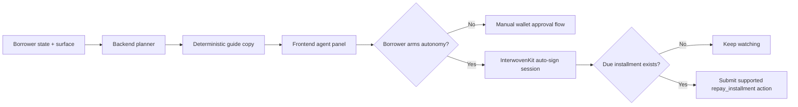

# Agentic Guide System

LendPay uses a server-side agent guide to turn borrower state into a concrete next best step. The guide drives panel copy, recommendations, and action labels while keeping repayment and credit state grounded in backend and onchain truth.

This page will keep being updated as LendPay expands the agent from guided recommendations into tighter borrower-approved automation.

## Two Layers

LendPay now has two distinct agent layers:

- a planner layer that explains the safest next move for the current account
- an optional autonomy layer that can repay a due installment when the borrower explicitly arms it

The planner is always deterministic. The autonomy layer is optional and stays bounded by wallet-managed permission.

## Planner Layer

The guide is generated by the backend planner and returned from:

`GET /api/v1/agent/guide`

It produces:

- a panel title and body
- a recommended next step
- an action key plus action label
- a confidence score
- a short borrower-state checklist

The frontend renders this guidance so the borrower sees one consistent explanation across Overview, Request, Repay, Rewards, and related surfaces.

## Borrower-Approved Autonomy

LendPay can now enter an autonomous repayment mode, but only after the borrower opts in.

Today that autonomy is intentionally narrow:

- it is limited to supported Move repayment calls
- it uses a temporary InterwovenKit auto-sign wallet session
- it only runs while the browser session is active on LendPay
- it can be paused by the borrower at any time

This means LendPay is not taking custody of funds or running a hidden server-side signer. The wallet keeps control, and the temporary helper session stays managed by InterwovenKit.

## What Must Be True Before Auto-Repay Can Run

Autonomous repayment is allowed only when all of these are true:

- the borrower connected an Initia wallet
- the borrower explicitly enabled InterwovenKit auto-sign
- the borrower explicitly armed LendPay auto-repay
- there is an active loan with a due installment
- the current chain and Move repayment action are supported
- the LendPay browser session is still active and synced

If any of those conditions drop away, LendPay falls back to manual repayment.

## What The Agent Can Do Now

- explain the safest next step for the borrower
- highlight upcoming due amounts and repayment pressure
- request temporary InterwovenKit auto-sign permission
- automatically submit the next due installment when autonomy is armed
- pause autonomy and return to manual approvals immediately

## What It Still Cannot Do

- it cannot transfer arbitrary funds
- it cannot repay without the borrower first granting permission
- it cannot keep acting after the wallet-managed session expires
- it cannot use a hidden backend hot wallet on behalf of the borrower
- it cannot override onchain truth, backend policy, or risk logic

This keeps the system agent-assisted and borrower-approved, not open-ended or custodial.

## Planner Inputs

The planner currently uses:

- latest score, risk band, APR, and limit
- loan requests and their status
- active loans and repayment schedule
- claimable rewards and borrower tier

These inputs come from backend state and onchain sync routines.

## Surfaces And Action Keys

The planner emits guidance for different UI surfaces:

- `overview`
- `analyze`
- `request`
- `loan`
- `rewards`
- `admin`

Typical action keys include:

- `analyze_profile`
- `open_request`
- `repay_now`
- `open_repay`
- `claim_rewards`

The frontend maps these keys to concrete UI actions such as opening the Request flow, starting a re-analysis, or launching repayment.

## Auto-Sign And Auto-Repay Flow

## Optional Ollama Rewrite

If you enable Ollama, the backend can rewrite the guide copy to sound more natural while keeping the same action.

To enable:

- set `AI_PROVIDER=ollama`
- configure `OLLAMA_BASE_URL`
- configure `OLLAMA_MODEL`

The rewrite layer is sanitized. If the model tries to introduce new amounts, dates, or facts, the response is discarded and the deterministic copy is used instead.

## Safety Guardrails

The agent system stays safe and explainable because:

- planner output cannot invent new action keys
- autonomy is limited to a narrow supported repayment path
- the wallet session is temporary and revocable by time or borrower choice
- the borrower can switch LendPay back to manual approvals at any time
- the backend and chain remain the final source of truth

## Related Docs

- [Scoring Criteria](/guide/scoring-criteria)
- [Architecture](/guide/architecture)
- [Frontend](/app/frontend)
- [Backend](/app/backend)
